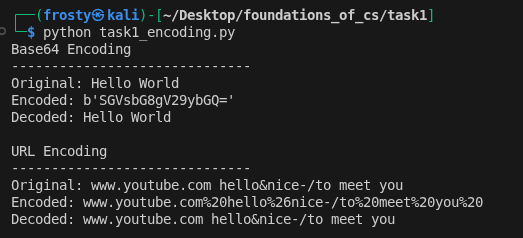

# Task 1 - Encoding Formats and Secure Data Exchange
## ST4015CMD Foundation of Computer Science
### BSc (Hons) Ethical Hacking & Cybersecurity

---

## Objective

This task demonstrates how encoding formats work in secure 
data exchange. It covers Base64 and URL encoding, showing 
how data is encoded and decoded in real world scenarios.

---

## Folder Structure
```
task1/
├── task1_encoding.py
├── output.png
└── README.md
```

---

## Overview

### Base64 Encoding
- Converts binary data into 64 printable text characters
- Used in email attachments, web authentication and HTTPS
- Increases data size by approximately 33%

### URL Encoding
- Replaces unsafe characters with % followed by hex digits
- Used in web addresses and search queries
- Helps prevent injection attacks

---

## Script

**task1_encoding.py** demonstrates:
- Base64 encoding and decoding of a message
- URL encoding and decoding of a web address

---

## Output



---

## How to Run

### Prerequisites
- Python 3

### Clone the Repository
```bash
git clone https://github.com/astrix0x/foundations_of_cs.git
cd foundations_of_cs/task1
```

### Run the Script
```bash
python3 task1_encoding.py
```

---

## Reflection

This task showed how encoding formats are used in everyday 
web communication. Base64 and URL encoding are both essential 
tools in cybersecurity as they are used in authentication, 
secure communication and can also be misused by attackers 
to bypass security filters.

---

## Tools Used
- Python 3
- Kali Linux
