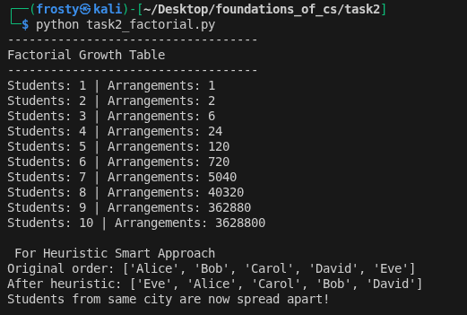

# Task 2 - P vs NP and Seating Arrangement Problem
## ST4015CMD Foundation of Computer Science
### BSc (Hons) Ethical Hacking & Cybersecurity

---

## Objective

This task explores computational complexity using a classroom 
seating arrangement scenario. It explains the difference between 
P and NP problems, demonstrates factorial growth of possible 
arrangements, and shows how a heuristic approach can find a 
good solution quickly.


## Folder Structure
```
task2/
├── task2_factorial.py
├── output.png
└── README.md
```

---

## Overview

### P Problems
A problem is in P if it can be solved quickly by a computer. 
The time needed grows slowly as the input gets bigger.

### NP Problems
A problem is in NP if a given solution can be checked quickly, 
even if finding the solution is hard.

### The Seating Problem
- Checking a seating plan = Easy (P)
- Finding a valid seating plan = Hard (NP)
- For n students there are n! possible arrangements

### Heuristic Approach
Instead of checking every arrangement, the heuristic:
- Sorts students by city first
- Spreads students from same city apart
- Finds a good enough solution quickly

---

## Script

**task2_factorial.py** demonstrates:
- Factorial growth table showing arrangements for 1-10 students
- Heuristic seating approach separating students by city

---

## Output



---

## How to Run

### Prerequisites
- Python 3

### Clone the Repository
```bash
git clone https://github.com/astrix0x/foundations_of_cs.git
cd foundations_of_cs/task2
```

### Run the Script
```bash
python3 task2_factorial.py
```

### Expected Output
```
Factorial Growth Table
-------------------------------
Students: 1 | Arrangements: 1
Students: 2 | Arrangements: 2
Students: 3 | Arrangements: 6
Students: 4 | Arrangements: 24
Students: 5 | Arrangements: 120
Students: 6 | Arrangements: 720
Students: 7 | Arrangements: 5040
Students: 8 | Arrangements: 40320
Students: 9 | Arrangements: 362880
Students: 10 | Arrangements: 3628800

For Heuristic
Original order: ['Alice', 'Bob', 'Carol', 'David', 'Eve']
After heuristic: ['Eve', 'Alice', 'Carol', 'Bob', 'David']
Students from same city are now spread apart!
```

---

## Reflection

This task showed that some problems are easy to check but 
hard to solve. The factorial growth table clearly demonstrates 
why brute force becomes impractical for large inputs. The 
heuristic approach provides a faster alternative that gives 
a good enough solution without checking every possibility.

---

## Tools Used
- Python 3
- Kali Linux
